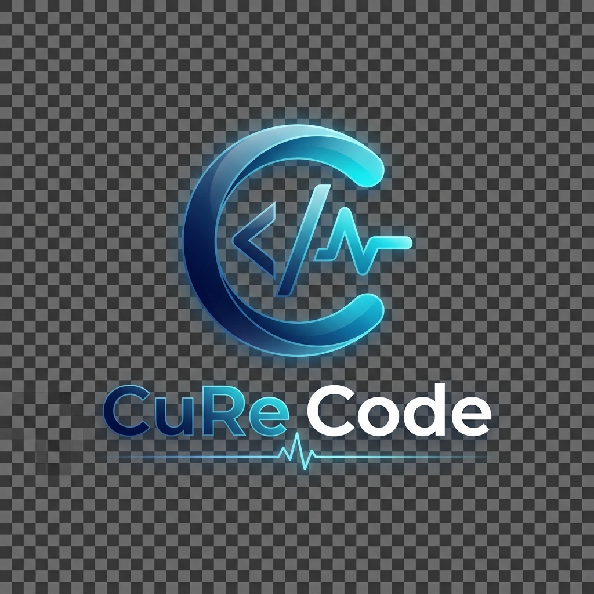

<div align="center">
 


# CuRe Code

**AI Coding Agent for Your Terminal**

[](https://github.com/broman0x/cure-code/releases/latest)
[](LICENSE)
[](https://github.com/broman0x/cure-code)
[](https://go.dev)

An agentic AI coding assistant that lives in your terminal.
Built with Go for speed and portability.

</div>

---

## What is CuRe Code?

CuRe Code is an **AI coding agent** that can read, write, and edit your code directly from the terminal. Unlike simple chat-based CLI tools, CuRe Code uses an **agentic loop** — it autonomously decides which tools to use, reads your files, makes changes, runs commands, and iterates until the task is complete.

### Key Features

| Feature | Description |
|---------|-------------|
| **Agentic Loop** | AI autonomously reads, writes, edits files and runs commands |
| **15 Built-in Tools** | Read/Write, Web Search, Project Summary, Git Info, and more |
| **Multi-Provider** | Google Gemini, OpenAI, Claude, NVIDIA, Groq, DeepSeek, Ollama |
| **Smart Context** | Tag files directly in your prompt using `@filename` |
| **Process Manager** | Run and manage background tasks with `/ps` |
| **Confirmation Flow** | Dangerous operations require your approval (or use `--yolo`) |
| **Single Binary** | No Node.js, no Python — just one Go executable |
| **REPL + One-shot** | Interactive mode or `curecode "fix the tests"` |

### Built-in Tools

| Tool | Purpose |
|------|---------|
| `read_file` / `read_many` | Read contents of one or multiple files |
| `write_file` / `edit_file` | Create new files or perform search-and-replace edits |
| `shell` | Execute any terminal command (with confirmation) |
| `grep_search` | Search for patterns across the entire project |
| `symbol_search` | Find functions, classes, and structs using regex |
| `project_summary` | Get a high-level overview of the codebase structure |
| `git_info` | Check current git status and branch information |
| `web_search` / `web_fetch` | Search the internet and fetch documentation/content |
| `todo` | Track and manage tasks within the agent session |

---

## Quick Start

```bash
# Download the binary for your platform, then:
./curecode --install    # Install to PATH
curecode                # Launch REPL
```

### One-shot Mode

```bash
curecode "explain this codebase"
curecode "add error handling to main.go"
curecode "write tests for the auth module"
```

## Setup

### Option 1: Google Gemini (Recommended)

```bash
export GEMINI_API_KEY="your-key-from-aistudio.google.com"
curecode
```

### Option 2: OpenAI

```bash
export OPENAI_API_KEY="your-key-from-platform.openai.com"
curecode
```

### Option 3: Anthropic Claude

```bash
export ANTHROPIC_API_KEY="your-key-from-console.anthropic.com"
curecode
```

### Option 4: NVIDIA NIM (Reasoning)

```bash
export NVIDIA_API_KEY="your-key-from-build.nvidia.com"
curecode
```

### Option 5: DeepSeek

```bash
export DEEPSEEK_API_KEY="your-key"
curecode
```

### Option 6: Ollama (Free, Local)

```bash
# Install from https://ollama.com
ollama pull llama3
curecode
```

---

## Slash Commands

| Command | Description |
|---------|-------------|
| `/help` | Show available commands |
| `/model` | Switch AI provider/model |
| `/clear` | Clear screen |
| `/compact` | Clear conversation history |
| `/ps` | List or stop background processes |
| `/usage` | Show session token usage |
| `/save` | Save current session |
| `/resume` | Resume a saved session |
| `/version` | Show version |
| `/exit` | Exit CuRe Code |

---

## How It Works

CuRe Code uses a sophisticated **agentic architecture** to solve complex tasks:

```
User Prompt
    ↓
AI decides which tools to call
    ↓
┌──────────────────────────────┐
│   Tool Execution Loop        │
│                              │
│   read_file  → understand    │
│   edit_file  → make changes  │
│   shell      → run tests     │
│   grep_search → find patterns│
│   web_search → look up docs  │
│   git_info   → check status  │
│                              │
│   (with confirmation for     │
│    destructive operations)   │
│                              │
└──────────────────────────────┘
    ↓
AI provides final response
```

The AI has full autonomy to chain multiple tool calls until the task is complete, with a safety limit of 25 turns per prompt.

---

## Architecture

```
cure-code/
├── main.go                     # Entry point
├── cmd/
│   ├── root.go                 # REPL, one-shot, slash commands
│   └── install_self.go         # Self-installer
├── internal/
│   ├── agent/
│   │   ├── agent.go            # Agentic loop (core)
│   │   ├── message.go          # Message/ToolCall types
│   │   ├── process.go          # Background process manager
│   │   ├── session.go          # Session persistence
│   │   └── system_prompt.go    # Dynamic prompt builder
│   ├── ai/
│   │   ├── fc_providers.go     # Multi-provider implementation
│   │   └── streaming.go        # Real-time token streaming
│   ├── config/
│   │   └── config.go           # Configuration & API keys
│   ├── tools/
│   │   ├── registry.go         # Tool interface & registry
│   │   ├── read_file.go        # Read file contents
│   │   ├── write_file.go       # Create/overwrite files
│   │   ├── edit_file.go        # Search & replace edits
│   │   ├── shell.go            # Execute shell commands
│   │   ├── list_dir.go         # Browse directories
│   │   ├── grep.go             # High-performance search
│   │   ├── web_search.go       # Search the web
│   │   ├── project_summary.go  # Codebase overview
│   │   └── symbol_search.go    # Find symbols with regex
│   └── ui/
│       ├── banner.go           # Startup visual
│       └── markdown.go         # Terminal MD renderer
└── go.mod
```

---

## Building from Source

```bash
# Requirements: Go 1.25+
git clone https://github.com/broman0x/cure-code.git
cd cure-code
go build -o curecode .

# Or cross-compile:
GOOS=linux GOARCH=amd64 go build -o curecode-linux .
GOOS=darwin GOARCH=arm64 go build -o curecode-mac .
GOOS=windows GOARCH=amd64 go build -o curecode.exe .
```

---

## File Locations

| Platform | Config | Binary |
|----------|--------|--------|
| **Windows** | `%APPDATA%\curecode\config.json` | `%LocalAppData%\curecode\curecode.exe` |
| **Linux/macOS** | `~/.config/curecode/config.json` | `~/.local/bin/curecode` |

---

## License

MIT — see [LICENSE](LICENSE) for details.
